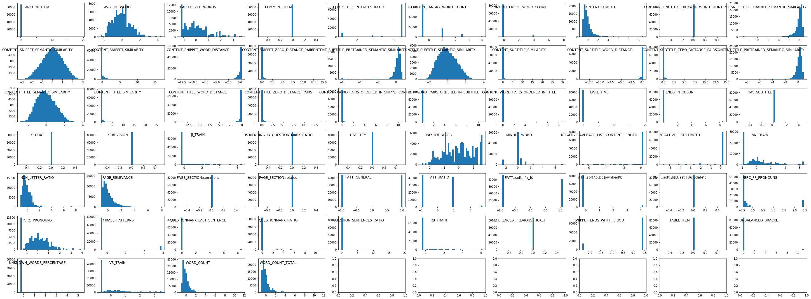
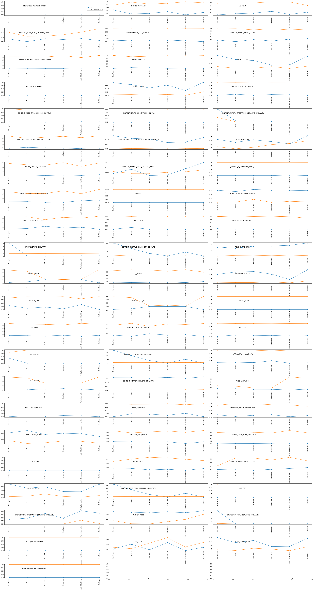
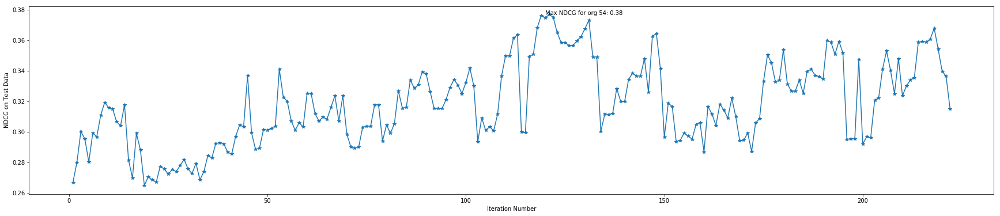

```python
import json
import math
from time import time
import pickle as pk
import pandas as pd
import codecs
from nltk import WordNetLemmatizer
import re
from collections import defaultdict, Counter
import numpy as np
from sklearn.metrics import pairwise_distances
from gensim.models import Doc2Vec, Word2Vec, KeyedVectors
import boto
import os
import gzip
import argparse
import matplotlib.pyplot as plt
from scipy import stats
import gc
from sklearn.model_selection import StratifiedShuffleSplit
from collections import defaultdict
import logging

from pysolvvy.apis.api_client import ApiException
from pysolvvy.util import get_active_orgs, get_org_name
from pysolvvy.apis.api_caucuses import ApiCaucus
from pysolvvy.apis.api_queries import ApiQueries
from pysolvvy.apis.api_solutions import ApiSolutions
from pysolvvy.apis.api_search import ApiSearch
from pysolvvy.apis.api_skynet import ApiSkynet

''' 
set visial effects
'''
# enable code folding
from notebook.nbextensions import check_nbextension
check_nbextension('codefolding', user=True)
check_nbextension('codefolding/main.js', user=True)
ext_require_path = 'codefolding/main'
try:  # notebook >= 4.2.0
    from notebook.nbextensions import enable_nbextension
    enable_nbextension('notebook', ext_require_path)
except ImportError:
    from notebook.nbextensions import EnableNBExtensionApp
    EnableNBExtensionApp().enable_nbextension(ext_require_path)

# adjust width
from IPython.core.display import display, HTML
display(HTML("<style>.container { width:100% !important; }</style>"))
        
HTML("""
<style>
.output_png {
    display: table-cell;
    text-align: center;
    vertical-align: middle;
}
</style>
""")    

# disable code folding
# ext_require_path = 'codefolding/main'
# try:  # notebook >= 4.2.0
#     from notebook.nbextensions import disable_nbextension
#     disable_nbextension('notebook', ext_require_path)
# except ImportError:
#     from notebook.nbextensions import DisableNBExtensionApp
#     DisableNBExtensionApp().disable_nbextension(ext_require_path)
```


<style>.container { width:100% !important; }</style>


<style>
.output_png {
    display: table-cell;
    text-align: center;
    vertical-align: middle;
}
</style>


# Tutorial 

## Prototyper Python Package 

### Main modules:

 * ### metrics.py:
   - Connects to different Solvvy APIs using pysolvvy python package and gets required data using different methods.
   - Calcaultes evaluation metrics (e.g., NDCG) for the current suggestion by the Solvvy APIs or using new ranking methods (model_classes and rankers modules).
   

 * ### feature_engineering.py:
   - Downloads, loads, and parses pre-calculated feature files from S3.
   - Loads and parses pre-calcuated token embeddings file for generating sematic features.
   - Loads pre-trained languages model for generating sematic features.
   - Generates new features, e.g., sematic similarity using different NLP approaches.
   - Combines pre-calcuated (current) features with new generated features and saves them to class instance.
   - Calcuates aggregate statistics on features from different orgs for better comparison and feature engineering.
   - plots distirbution of features for each org or aggregate statistics across orgs for better feature engineering.
   
 * ### model_classes.py
   - Contains different model classes for fast and flexible experimentation different classification and ranking algorithms.
   - Performs training, feature selection, and prediction based on a defined uniform API.
   
 * ### rankers.py
   - Implements different ranking algorithms using models defined in the model_classes.py module.
   
 * ### utils.py
   - Contains utility classes used by the above modules.
 

***
- ### metrics.py

    Example:


```python
from prototyper.metrics import Metrics

org_id = 54

metrics_class_instance = Metrics(env='local', org_id=54)
ndcgs_per_q_id, ndcg_all = metrics_class_instance.get_ndcg(ranker=None, partition='test')
```

    
    Starting NDCG calculation process ...
    -------------
    Org: Headspace
    -------------
    Not using the cached results. If you are going to repeat this process, use 'cache_results'and 'use_cached' method arguments to decrease costs of next runs.
    => Org Headspace (54): Queries Passed = 72.22 % (39/54), NDCG = 0.355
    Total time spent: 480.24236392974854 seconds.


***
- ### feature_engineering.py

    Examples:


```python
from prototyper.feature_engineering import FeatureGeneration

# this module uses boto Python package for downloading files from S3, the aws_access_key_id and aws_secret_access_key should be either putin .aws/credentials or .boto or given as
# method arguments
feature_gen_instance_all = FeatureGeneration()    # to load, parse, and hold all data (from all partitions) 
feature_gen_instance_train = FeatureGeneration()  # to load, parse, and hold data only from train partitions (for training)
```

        - Downlaoding, loading, and parsing files from S3


```python
'''
downloading precalculated features from S3, loading/parsing it, and saving it to class variables. Running it for all partitions ('test' and 'train' to make sure all data is loaded for 
training the model)
'''
# all data 
bucket, prefix = feature_gen_instance_all.get_features_s3address_org(org_id=org_id, partition='test')
dest = feature_gen_instance_all.download_pre_calculated_features_s3(bucket=bucket, prefix=prefix)
feature_gen_instance_all.load_pre_calculated_features_s3(pre_calculated_features_address=dest)

bucket, prefix = feature_gen_instance_all.get_features_s3address_org(org_id=org_id, partition='train')
dest = feature_gen_instance_all.download_pre_calculated_features_s3(bucket=bucket, prefix=prefix)
feature_gen_instance_all.load_pre_calculated_features_s3(pre_calculated_features_address=dest)

feature_gen_instance_all.get_current_weights_from_downloded_s3(dest) # can be used as initial values for training ML models in model_classes or testing model for current weights

# train data 
bucket, prefix = feature_gen_instance_train.get_features_s3address_org(org_id=org_id, partition='train')
dest = feature_gen_instance_train.download_pre_calculated_features_s3(bucket=bucket, prefix=prefix)
feature_gen_instance_train.load_pre_calculated_features_s3(pre_calculated_features_address=dest)

```

    
    Downloading feature file from S3 ...
    Downloaded file from bucket <Bucket: solvvy-ml-data> and prefix 54/predictions/07f6c3db-2155-4068-8baa-10417052ff49.txt.gz on S3. Time spent: 11.199934959411621 seconds.
    
    Reading and parsing downloaded feature file from S3 ...
    Finished parsing and saving features/labels from downloaded files from S3. Time spent: 3.231765031814575 seconds.
    
    Downloading feature file from S3 ...
    Downloaded file from bucket <Bucket: solvvy-ml-data> and prefix 54/predictions/2e498385-1c06-4f98-a2d3-1d42929e8f30.txt.gz on S3. Time spent: 53.775588035583496 seconds.
    
    Reading and parsing downloaded feature file from S3 ...
    Finished parsing and saving features/labels from downloaded files from S3. Time spent: 9.833620071411133 seconds.
    
    Downloading feature file from S3 ...
    Downloaded file from bucket <Bucket: solvvy-ml-data> and prefix 54/predictions/2e498385-1c06-4f98-a2d3-1d42929e8f30.txt.gz on S3. Time spent: 53.588988065719604 seconds.
    
    Reading and parsing downloaded feature file from S3 ...
    Finished parsing and saving features/labels from downloaded files from S3. Time spent: 9.720598936080933 seconds.


        - Loading/parsing embeddings or language models, and generating new features


```python
# loading language model 
feature_gen_instance_all.load_process_trained_model(lang_model_address="./src/trainedModelBySupportData", model='doc2vec')

# or token embedings (and parsing it) for generating sematic features
feature_gen_instance_all.load_process_pre_calculated_embeddings(token_embeddings_address="./src/embedings_sample.txt", sep='\t')

''' 
calculating new (currently just semantic similarity, may be updated in future) features
'''
# finding set of (query,solutions) pairs for the current org_id (for calculating features for) and assigning it to class variables
metrics_class_instance.set_org_id(org_id=org_id)

t0 = time()
print("\nGetting query ids for org %s ... " % org_id)
query_ids_test = metrics_class_instance.get_queryids_for_org(partition='test')
query_ids_train = metrics_class_instance.get_queryids_for_org(partition='train_1')
query_ids = query_ids_test.union(query_ids_train)

t1 = time()
query_ids = set(list(query_ids)[:20])  # for faster process
print("Getting query solution pairs for org %s ..." % org_id)
feature_gen_instance_all.query_solutions_pair = metrics_class_instance.get_queryjson_solutionsjson_pairs(query_ids=list(query_ids)[:3])

t2 = time()
print("\nRetrieved the required documents. Time spent: %s + %s = %s seconds" % (t1 - t0, t2 - t1, t2 - t0))

# calcuating new features
embed_func = feature_gen_instance_all.embed_model # or embed_func = feature_gen_instance.embed_average
feature_gen_instance_all.calculate_new_features(embed_func=embed_func, embed_tag="doc2vec")

# don't want new features this time! 
feature_gen_instance_all.new_features = {}

# preparing combined/final feature/labels and normalizing features (combines new generated features and pre-calcuated ones, if any!)
feature_gen_instance_all.combine_features()           # this step is necessary, since other classes that use this instance use a class variable assigned here

# *********************************************************************************
# **** the same should be done for instance of FeatureGeneration class for training
feature_gen_instance_train.combine_features()    # this step is necessary, since other classes that use this instance use a class variable assigned here

```

    
    Loading pre-trained language model ...
    Language model successfully loaded.
    
    Reading and parsing pre-calculated embeddings ...
    Parsed and saved pre-calculated token embeddings. Time spent: 0.007929801940917969 seconds.
    
    Getting query ids for org 54 ... 
    Getting query solution pairs for org 54 ...
    
    Retrieved the required documents. Time spent: 2.825796127319336 + 17.950270891189575 = 20.77606701850891 seconds
    
    Calculating new features ...
    
    Calculating semantic similarity features for pairs of query-solutions (saved to class variable) ...
    Finished calculating semantic similarity features for query-document/solution pairs. Time spent: 0.014371871948242188 seconds
    All new features calculate. Time spent: 0.014445066452026367 seconds.


        - Plotting features, exploratory data analysis, ...


```python
# plot histograms
features = feature_gen_instance_all.return_features_as_dataframe()
feature_gen_instance_all.plot_features_dist_oneOrg(features=features.iloc[:, 2:])
```

    
    Preparing histogram plots of features ...
    Prepared plots. Time spent: 7.560840845108032 seconds.





```python
# plot aggregate statistics  (**** THIS MAY TAKE TIME!!!****)
org_ids = [26, 42, 53, 54, 72, 84]
features_orgs_metrics = feature_gen_instance_all.feature_aggr_stats_orgs(org_ids=org_ids, partition='test', verbose=False)
feature_gen_instance_all.plot_aggr_stats_allOrgs(features_orgs_metrics=features_orgs_metrics)
```

    
    Preparing plots for aggregate stats/metrics for features across orgs ...
    
    Prepared plots to show. Total time spent: 157.520761013031 seconds





***
- ### model_classes.py

    Example:


```python
# from prototyper.model_classes import WARP


# initializing model with all retrieved/processed data (may be necessary just for WARP, since we need to calculate NDCG)
warp_instance = WARP(feature_gen_instance=feature_gen_instance_all, learning_rate=0.1, org_id=org_id)
warp_instance.prepare_data(feature_gen_instance=feature_gen_instance_all)

# preparing training data (positive and negative data)
warp_instance.generate_positive_negative_data(feature_gen_instance_train=feature_gen_instance_train)
```


```python
# start training, have fun!
ndcg_per_iter = warp_instance.train_model(initialize_weights=True, verbose=False)
```

    2017-10-27 09:12:16,953 [root] [WARNING] Setting initial weights to zero.


    Not using the cached results. If you are going to repeat this process, use 'cache_results' and 'use_cached' method arguments to decrease costs of next runs.


```python
import matplotlib.pyplot as plt

_ = plt.close()

_ = plt.figure(figsize=(30, 6))
_ = plt.plot(range(1, len(ndcg_per_iter) + 1), ndcg_per_iter, marker='*')
_ = plt.xlabel("Iteration Number")
_ = plt.ylabel("NDCG on Test Data")
_ = plt.text(x=np.argmax(ndcg_per_iter), y=max(ndcg_per_iter), s="Max NDCG for org %s: %s" % (org_id, np.round(max(ndcg_per_iter), 2)))

plt.show()
```





```python

```
